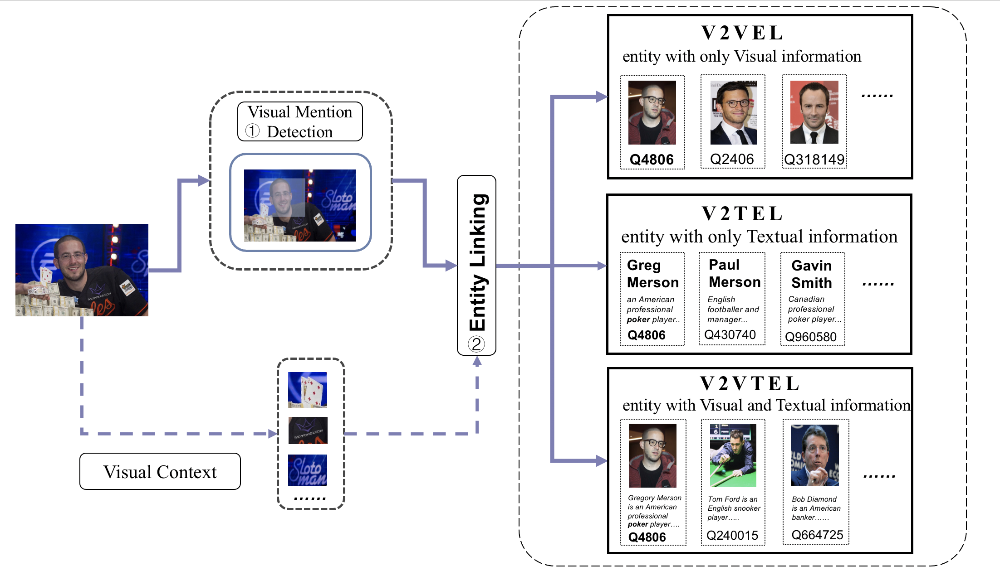

## Visual Named Entity Linking
### Datasets for Visual Named Entity Linking
---
#### Introduction
---
WIKIPerson is a high-quality human-annotated visual person linking dataset dataset focused on Visual Named Entity Linking. Unlike previously commonly-used datasets in entity linking, the mention in WIKIPerson is only an image containing the PERSON entity with its bounding box. The corresponding label identifies an unique entity in Wikipedia. For each entity in Wikipedia, we provide textual descriptions as well as images to satisfy the need of three sub-tasks.

#### VNEL task
---
The VNEL takes an image as input with bounding boxes around objects, and then links them to entities in KB. 

Generally, each entity $e_i \in E$ is often characterized by rich textual and visual descriptions, and each modality of the description can provide sufficient information for visual entity linking. To make the task more clearly presented, we further decompose the VNEL task into three sub-tasks(i.e., visual to visual entity linking (V2VEL), visual to textual entity linking (V2TEL), and visual to visual-textual entity linking (V2VTEL)) according to the type of description used in learning entity embeddings. 

- V2VEL
In the first place, only the visual description $V_{e_i}$ of the entity is used in the visual entity linking stage, which we denote as the V2VEL sub-task. The core of V2VEL is to match two visual objects. It is worth noting that entities in KB may contain more than one image. To simplify this, we take the first image of $e_i$ as $V_{e_i}$ and leave the multiple images per entity as the future work. 

- V2TEL
In the second place, only the textual description $T_{e_i}$ of the entity is used in the visual entity linking stage, which we denote as the V2TEL sub-task. The V2TEL task aims to evaluate the ability in image-text matching, central to cross-modal entity linking.

- V2VTEL
Finally, both the visual description and the textual description $(V_{e_i}, T_{e_i})$ of the entity could be employed to link the visual mention, which we denote as the V2VTEL sub-task. The V2VTEL task could leverage both textual and visual modality to complement each other in linking visual mentions.

#### Datasets
----
Since only the entity information varies in different sub-tasks, we split Knowledge Base  size into three parts and share the same the train, dev and test datasets in three sub-tasks.

(We only release the test set and we will release all results after the paper accepted.)

| Type  |                           Filename                           | File Size |                                        Num Records |
| :---- | :----------------------------------------------------------: | --------: | -------------------------------------------------: |
| Train |                            train                             |     912MB | [125.jpg]   \[id:125, boudingbox:[], label:Q22686] |
| Dev   |                             dev                              |     285MB |                                  Same as the train |
| Test  | [test](https://1drv.ms/u/s!An1FOVJ0d3wsbYBrnX5ic8MI0dc?e=OYwvnU) |     294MB |                                  Same as the train |

- V2VEL

| Type      | Filename | File Size     | Num Records     |
| :---        |    :----:   |          ---: |          ---: |
| Knowledge Base      | KB_visual | 5,512MB |[Q22686.jpg, ...]|

- V2TEL

| Type      | Filename | File Size     | Num Records     |
| :---        |    :----:   |          ---: |          ---: |
| Knowledge Base      | [KB_textual](https://1drv.ms/u/s!An1FOVJ0d3wsbCxErXSCwwMek1M?e=f46diI) | 7MB |[Q226868:{'Name':"", 'Description':"",...}...]|

- V2VTEL

| Type      | Filename | File Size     | Num Records     |
| :---        |    :----:   |          ---: |          ---: |
| Knowledge Base | KB_visual_textaul | 5,519MB |Both images and text information  avaiable|

#### Use of external information
IMPORTANT NOTE: You are allowed to use external information while developing your runs.

