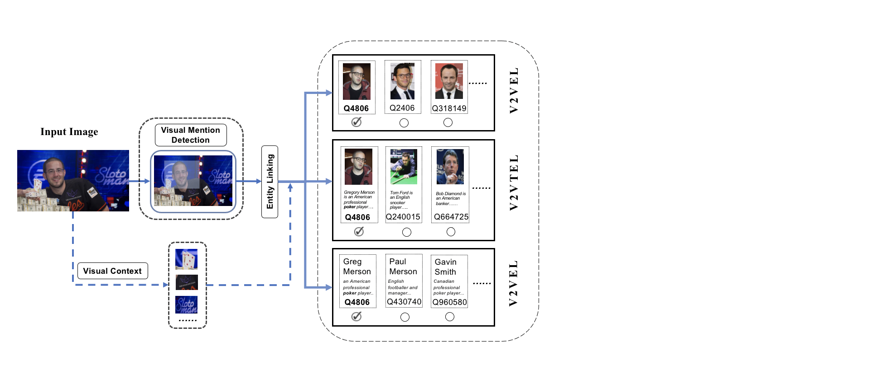

## Visual Named Entity Linking
#### Introduction
---
The VNEL(Visual Named Entity Linking) takes an image as input, then recognize visual mentions with bounding boxes around and links them to the corresponding entities in the large Knowledge Base. As a named entity linking task, it transfers the scenario from the traditonal textual modality to the pure visual modality.

#### Sub-tasks

---

Generally, each entity is often characterized by rich textual and visual descriptions, and each modality of the description can provide sufficient information for visual entity linking. To make the task more clearly presented, we decompose the VNEL task into three sub-tasks(i.e., visual to visual entity linking (V2VEL), visual to textual entity linking (V2TEL), and visual to visual-textual entity linking (V2VTEL)) according to the type of description used in learning entity embeddings. 

- **V2VEL**
  Only the visual description of the entity in KB can be used in the visual entity linking stage. The core of V2VEL is to match two visual objects and some advanced CBIR methods could be adopted to test the performance. 
- **V2TEL**
  Only the textual description of the entity in KB can be used in the visual entity linking stage. The V2TEL task aims to evaluate the ability in image-text matching, central to cross-modal entity linking.
- **V2VTEL**
  Both the visual description and the textual description of the entity in KB could be employed to link the visual mention. The V2VTEL task could leverage both textual and visual modality to complement each other in linking visual mentions.

**To participate in the VNEL leaderboard, please go here: https://jqhlgsxvmn.github.io/JQHlGSXvMN-github.io/**

#### Datasets
----
WIKIPerson is a high-quality human-annotated visual person linking dataset focused on Visual Named Entity Linking. Unlike previously commonly-used datasets in entity linking, the mention in WIKIPerson is only an image containing the PERSON entity with its bounding box. The corresponding label identifies a unique entity in Wikipedia. As the most common entity type with relatively low annotating cost, we first focus our research on the PERSON type and use it as data V1.0. We will extend locations, yachts, and other more diverse types of the entity in the future.

Notice that our dataset is labeled on the News-related dataset with diverse agencies such as USA TODAY, BBC, the Washington Post, and so on, which means the quality of the image is much higher than the image that is directly searched by search engine. 

#### Dataset Example

------

The covered entity in the images is diverse with different occupations, ages, countries, and so on. Besides, it is also consistent with long-tail distribution which requires higher linking ability.

#### Getting Data

------

**To access our dataset, please refer to this kaggle link.** 

|                 | #Image | #Coverd Entity | #$M_{avg}^{I}$ | #Knowledge Base |
| --------------- | ------ | -------------- | -------------- | --------------- |
| WIKIPerson_V1.0 | 48k    | 13K            | 1.08           | 120K            |

WIKIPerson contains two main parts. The first part is the Knowledge Base which serves as the recall corpus of the entity linking, the goal of the task is to find the correct entity in the Large KB. Given three sub-tasks of VNEL, we provide both textual and visual Knowledge_Base. In V1.0, the scale of KB is about 120K.

- V2VEL

| Type      | Entity Scale | File Size     | Instance Format |
| :---        |    :-----   |          :--- |          :--- |
| Visual_Knowledge_Base_V1.0 | 120K | 5.31GB |["Q23.jpg", "Q24.jpg", "Q42.jpg", "Q76.jpg", ...., "Q100669073".jpg]|

- V2TEL

| Type      | Entity Scale | File Size     | Instance Format |
| :---        |    :----:   |          ---: |          ---: |
| Textual_Knowledge_Base_V1.0 | 120K | 7.35MB |[{"id": "Q4842236", "name": "Bahador Abdi", "description": "Iranian footballer", "image_url": "...", "lastrevid": 1501164266, "modified": "2021-09-21T11:56:36Z", "..."},......]|

- V2VTEL

| Type      | Entity Scale | Instance Format |
| :---        |    :----:   |          ---: |
| Multimodal_Knowledge_Base_V1.0 | 120K |Contains  both Visual and Textual Information|

The second part of WIKIPerson is the high-quality annotated images which contain the entity's bounding box in each image and its corresponding entity in KB (Here, we use Wikipedia as the backend). All images are resized to 224 x 224.

| Type                      | Instance Nums |                                              Instance Format |
| :------------------------ | :-----------: | -----------------------------------------------------------: |
| WIKIPerson_Train_Dev_V1.0 |      40k      | [ {"id": 38880, "image": "957681.jpg", "boundingbox": "[98.13902, 34.79829, 143.4635, 114.44523]", "wikiid": "Q342282"},..] |
| WIKIPerson_Test_V1.0      |      6k       | [{"id": 0, "image": "136577.jpg", "boundingbox": "[121.3156, 42.358982, 169.73543, 118.90385]", "wikiid": "Q22686"}...] |

(Notice：After the split of the original dataset and to debias influence of the entity's popularity, we remove some instances so that each entity appears at most once in WIKIPerson_Test_V1.0. It may make the sum of numbers slightly smaller than 48k.)

#### Legal Notices

------

Any contributors grant you a license to the WIKIPerson Dataset and other content in this repository under the under the [MIT License](https://opensource.org/licenses/MIT), see the LICENSE.md file.

Any contributors reserve all other rights, whether under their respective copyrights, patents, or trademarks, whether by implication, estoppel or otherwise.

#### Citing

------

If you find our task/dataset useful, please consider citing it after the paper is accepted.